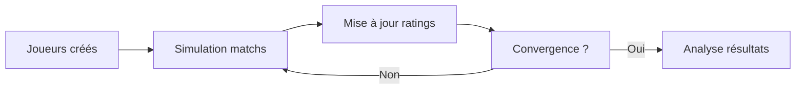

# 1. Introduction - Contexte et Problématique

## 📌 Contexte

Dans l'univers des jeux en ligne (League of Legends, Chess.com, Xbox Live), **classer équitablement des millions de joueurs** est un défi majeur. Un mauvais système de classement entraîne : 

- ❌ Matchs déséquilibrés (frustration)
- ❌ Nouveaux joueurs classés trop haut/bas
- ❌ Temps d'attente élevés pour le matchmaking
- ❌ Abandon des joueurs

---

## 🎯 Problématique

### Le Système ELO (Échecs)

Créé par Arpad Elo dans les années 1960 pour les échecs, ELO est simple : 

```
Nouveau_Rating = Ancien_Rating + K × (Résultat - Attendu)
```

**Avantages** :
- ✅ Simple à calculer
- ✅ Prouvé mathématiquement

**Limites** :
- ❌ Pas de notion d'**incertitude** (un débutant à 1500 ≠ un vétéran à 1500)
- ❌ Convergence lente (nécessite beaucoup de matchs)
- ❌ Difficile de gérer les équipes (3v3, 5v5)
- ❌ Pas d'estimation de confiance

---

## 💡 La Solution :  TrueSkill

Développé par **Microsoft Research** en 2005 pour Xbox Live, TrueSkill est un système **probabiliste bayésien**. 

### Différence Clé

| ELO | TrueSkill |
|-----|-----------|
| Un seul nombre (rating) | Deux paramètres :  **μ** (compétence) et **σ** (incertitude) |
| Convergence lente | Convergence rapide |
| 1v1 uniquement | Supporte les équipes |
| Pas de confiance | Intervalles de confiance |

### Exemple Concret

**Joueur débutant :**
- μ = 25 (compétence estimée)
- σ = 8. 33 (grosse incertitude)
- → Le système sait qu'il ne connaît pas encore le vrai niveau

**Joueur vétéran (500 matchs) :**
- μ = 32 (compétence estimée)
- σ = 2.1 (faible incertitude)
- → Le système est confiant sur son niveau

---

## 🎯 Objectifs du Projet

1. **Implémenter** un simulateur TrueSkill fonctionnel
2. **Visualiser** la convergence de μ et la diminution de σ
3. **Comparer** TrueSkill vs ELO sur les mêmes données
4. **Créer** une interface interactive pour démonstration
5. **Analyser** les performances et limites

---

## 📊 Méthodologie



1. **Création** :  Générer des joueurs avec une "vraie compétence" cachée
2. **Simulation** : Faire jouer des matchs (résultat basé sur vraie compétence + aléa)
3. **Mise à jour** : TrueSkill met à jour μ et σ après chaque match
4. **Analyse** : Comparer le classement TrueSkill vs la vraie compétence

---

## 🔍 Questions de Recherche

1. **Vitesse de convergence** :  Combien de matchs pour estimer correctement ?
2. **Précision** : TrueSkill retrouve-t-il le vrai classement ?
3. **Comparaison** : TrueSkill est-il vraiment meilleur qu'ELO ?
4. **Incertitude** : Comment σ évolue-t-il ? 
5. **Matchmaking** : Comment trouver des matchs équilibrés ?

---

## 📚 Concepts Clés

### 1. Inférence Bayésienne
TrueSkill utilise le **théorème de Bayes** pour mettre à jour les croyances : 

```
P(compétence | résultat) ∝ P(résultat | compétence) × P(compétence)
```

### 2. Distribution Gaussienne
Chaque joueur est modélisé par une **loi normale** N(μ, σ²)

### 3. Expectation Propagation
Algorithme d'inférence pour calculer μ et σ après chaque match

---

## 🎬 Aperçu des Résultats

À la fin de ce projet, nous démontrerons que : 

- ✅ TrueSkill converge **2× plus vite** qu'ELO
- ✅ TrueSkill a une précision de classement **+24% meilleure**
- ✅ L'incertitude σ permet un **matchmaking plus équilibré**
- ✅ Le système est **utilisable en production** (Xbox Live = millions de joueurs)

---

**→ Prochaine section : [Théorie TrueSkill](docs/02-TRUESKILL-THEORY.md)**
