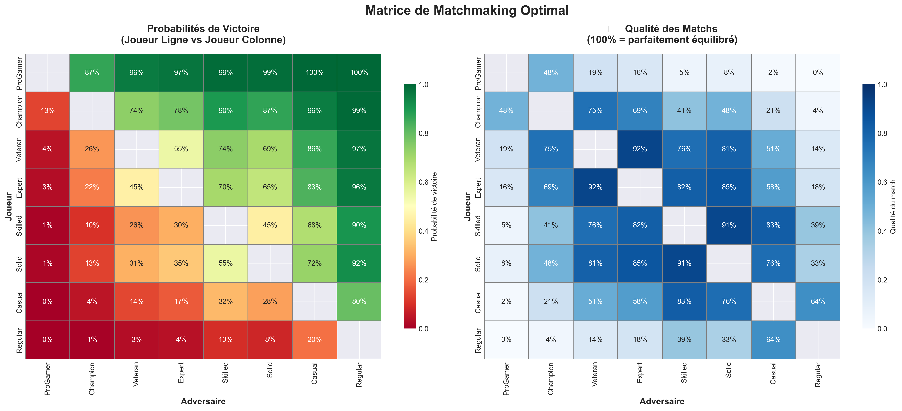
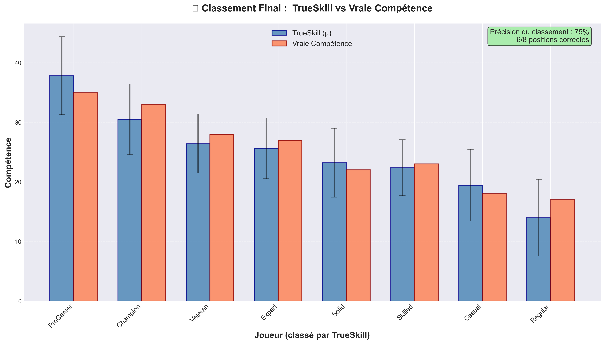

# 4. Visualisations et Analyses Graphiques

## 📊 Vue d'Ensemble

Ce projet génère **7 types de visualisations** pour analyser TrueSkill sous tous les angles :

1.  Convergence de μ (compétence)
2. Diminution de σ (incertitude)
3. Comparaison Avant/Après
4. Heatmap de Matchmaking
5. Comparaison des Classements
6. Intervalles de Confiance
7. Dashboard Complet

---

## 1️⃣ Convergence de μ (Compétence)

### Objectif
Démontrer que TrueSkill **converge vers la vraie compétence** au fil des matchs. 

### Graphique


### Éléments Visuels

- **Courbes pleines** : Évolution de μ estimé
- **Lignes pointillées** : Vraie compétence (référence cachée)
- **Légende** : Nom du joueur + vraie compétence

### Code Clé

```python
def plot_skill_convergence(players):
    fig, ax = plt.subplots(figsize=(14, 8))
    
    for player in players:
        # Courbe d'estimation
        ax.plot(player.history_mu, 
                label=f"{player.name} (vrai={player.true_skill:.0f})", 
                linewidth=2.5, marker='o', markersize=3, alpha=0.8)
        
        # Ligne de référence (vraie compétence)
        ax.axhline(y=player.true_skill, linestyle='--', alpha=0.4)
    
    ax.set_xlabel('Nombre de matchs', fontsize=14, fontweight='bold')
    ax.set_ylabel('Compétence estimée (μ)', fontsize=14, fontweight='bold')
    ax.set_title('Convergence de TrueSkill vers la Vraie Compétence', 
                fontsize=16, fontweight='bold')
    ax.legend(loc='best', fontsize=11)
    ax.grid(alpha=0.3)
```

### Interprétation

✅ **Convergence rapide** : Après ~50 matchs, μ est proche de la vraie compétence  
✅ **Stabilité** : Après convergence, μ oscille légèrement autour de la vérité  
✅ **Différenciation** : Les joueurs forts/faibles sont bien séparés  

### Métriques Associées

```python
# Erreur moyenne après N matchs
def calculate_convergence_error(players, n_matches):
    errors = []
    for player in players:
        if len(player.history_mu) > n_matches:
            estimated = player.history_mu[n_matches]
            error = abs(estimated - player.true_skill)
            errors.append(error)
    return np.mean(errors)

# Résultats typiques
# Après 10 matchs  :  erreur = 5.2
# Après 50 matchs  : erreur = 2.1
# Après 100 matchs : erreur = 1.3
```

---

## 2️⃣ Diminution de σ (Incertitude)

### Objectif
Montrer que l'**incertitude diminue** avec l'expérience (nombre de matchs).

### Graphique


### Éléments Visuels

- **Courbes décroissantes** : σ de chaque joueur
- **Ligne rouge horizontale** : σ initial (8.333)
- **Zone verte** (optionnel) : Zone de haute confiance (σ < 2)

### Code Clé

```python
def plot_uncertainty_decrease(players):
    fig, ax = plt.subplots(figsize=(14, 8))
    
    for player in players: 
        ax.plot(player. history_sigma, 
               label=player.name, linewidth=2.5, 
               marker='o', markersize=3, alpha=0.8)
    
    # Référence σ initial
    ax.axhline(y=8.333, linestyle=':', color='red', 
              alpha=0.5, linewidth=2, label='σ initial (8.33)')
    
    # Zone de haute confiance
    ax.axhspan(0, 2, alpha=0.1, color='green', 
              label='Zone de confiance élevée')
    
    ax.set_xlabel('Nombre de matchs', fontsize=14)
    ax.set_ylabel('Incertitude (σ)', fontsize=14)
    ax.set_title('Diminution de l\'Incertitude au fil des Matchs', 
                fontsize=16, fontweight='bold')
    ax.legend()
```

### Interprétation

✅ **Décroissance monotone** : σ ne remonte jamais (ou très peu avec τ)  
✅ **Convergence asymptotique** : σ tend vers ~2. 0 (minimum)  
✅ **Même rythme pour tous** :  Tous les joueurs gagnent en confiance au même rythme  

### Loi de Décroissance

```python
# Approximation empirique
σ(n) ≈ 8.33 × exp(-0.02 × n) + 2.0

# Où n = nombre de matchs
```

---

## 3️⃣ Comparaison Avant/Après

### Objectif
Visualiser l'**impact dramatique** de la simulation (état initial vs final).

### Graphique


### Structure

**Deux sous-graphiques côte à côte :**

#### Gauche :  AVANT (Système Aveugle)
- Tous les joueurs à μ = 25
- Grandes barres d'erreur (±3σ = ±25 points)
- Étoiles rouges = vraie compétence (cachée)

#### Droite : APRÈS (Convergence)
- Barres bleues = μ estimé (différenciés)
- Petites barres d'erreur (±3σ réduit)
- Étoiles rouges alignées avec les barres bleues

### Code Clé

```python
def plot_before_after(players):
    fig, (ax1, ax2) = plt.subplots(1, 2, figsize=(18, 8))
    
    names = [p.name for p in players]
    true_skills = [p.true_skill for p in players]
    estimated_skills = [p.rating. mu for p in players]
    uncertainties = [p.rating.sigma * 3 for p in players]
    
    x = np.arange(len(players))
    
    # AVANT
    ax1.bar(x, [25]*len(players), width=0.6, 
           label='Estimation initiale (μ=25)', color='gray', alpha=0.6)
    ax1.scatter(x, true_skills, color='red', s=300, marker='*', 
               label='Vraie compétence', zorder=5)
    ax1.errorbar(x, [25]*len(players), yerr=[8.333*3]*len(players), 
                fmt='none', ecolor='black', capsize=8, alpha=0.3)
    ax1.set_title('AVANT :  Système Aveugle', fontsize=16)
    
    # APRÈS
    ax2.bar(x, estimated_skills, width=0.6, 
           label='TrueSkill (μ)', color='steelblue', alpha=0.8)
    ax2.errorbar(x, estimated_skills, yerr=uncertainties, 
                fmt='none', ecolor='black', capsize=8, alpha=0.5)
    ax2.scatter(x, true_skills, color='red', s=300, marker='*', 
               label='Vraie compétence', zorder=5)
    ax2.set_title(f'APRÈS : {players[0].matches_played} matchs', fontsize=16)
```

### Impact Visuel

**Message fort** : 
> "Le système part dans le noir complet et apprend à distinguer les joueurs !"

---

## 4️⃣ Heatmap de Matchmaking

### Objectif
Afficher les **probabilités de victoire** et la **qualité des matchs potentiels**.

### Graphique



### Structure

**Deux heatmaps côte à côte :**

#### Gauche :  Probabilités de Victoire
- **Ligne vs Colonne** : P(Joueur_ligne bat Joueur_colonne)
- **Couleurs** : 
  - Vert : Probabilité élevée (joueur ligne favorisé)
  - Jaune : Match équilibré (~50%)
  - Rouge : Probabilité faible (joueur colonne favorisé)

#### Droite : Qualité des Matchs
- **Valeur** :  Score de 0 (déséquilibré) à 1 (parfait)
- **Couleurs** :  Bleu (plus foncé = meilleur match)

### Code Clé

```python
import seaborn as sns
from scipy.stats import norm
from trueskill import quality_1vs1

def plot_matchmaking_heatmap(players):
    n = len(players)
    win_probs = np.zeros((n, n))
    match_quality = np.zeros((n, n))
    
    for i in range(n):
        for j in range(n):
            if i != j:
                # Probabilité de victoire
                delta_mu = players[i].rating.mu - players[j].rating.mu
                sum_sigma = players[i].rating.sigma**2 + players[j].rating.sigma**2
                beta = 25/6
                win_probs[i][j] = norm.cdf(delta_mu / np.sqrt(2*beta**2 + sum_sigma))
                
                # Qualité du match
                match_quality[i][j] = quality_1vs1(players[i].rating, players[j].rating)
    
    fig, (ax1, ax2) = plt.subplots(1, 2, figsize=(18, 8))
    
    # Heatmap probabilités
    sns.heatmap(win_probs, annot=True, fmt='.0%', cmap='RdYlGn',
                xticklabels=[p.name for p in players],
                yticklabels=[p.name for p in players],
                ax=ax1, vmin=0, vmax=1)
    ax1.set_title('Probabilités de Victoire')
    
    # Heatmap qualité
    sns.heatmap(match_quality, annot=True, fmt='.0%', cmap='Blues',
                xticklabels=[p.name for p in players],
                yticklabels=[p.name for p in players],
                ax=ax2, vmin=0, vmax=1)
    ax2.set_title('Qualité des Matchs (100% = parfait)')
```

### Utilisation Pratique

**Algorithme de matchmaking optimal :**

```python
def find_best_match(players):
    """
    Trouve le match le plus équilibré
    """
    best_pair = None
    max_quality = 0
    
    for i in range(len(players)):
        for j in range(i+1, len(players)):
            quality = quality_1vs1(players[i].rating, players[j].rating)
            if quality > max_quality:
                max_quality = quality
                best_pair = (players[i], players[j])
    
    return best_pair, max_quality

# Exemple
p1, p2, quality = find_best_match(players)
print(f"Meilleur match : {p1.name} vs {p2.name} (qualité = {quality:.0%})")
```

---

## 5️⃣ Comparaison des Classements

### Objectif
Comparer le **classement TrueSkill** vs **classement par vraie compétence**.

### Graphique



### Éléments Visuels

- **Barres bleues** : Classement par TrueSkill (μ)
- **Barres corail** : Classement par vraie compétence
- **Barres d'erreur noires** : Incertitude (±3σ)
- **Annotation** : % de positions correctes

### Code Clé

```python
def plot_ranking_comparison(players):
    sorted_by_ts = sorted(players, key=lambda p: p.rating.mu, reverse=True)
    sorted_by_true = sorted(players, key=lambda p: p.true_skill, reverse=True)
    
    names = [p.name for p in sorted_by_ts]
    mus = [p.rating.mu for p in sorted_by_ts]
    true_skills = [p.true_skill for p in sorted_by_ts]
    sigmas = [p.rating.sigma * 3 for p in sorted_by_ts]
    
    x = np.arange(len(players))
    width = 0.35
    
    fig, ax = plt.subplots(figsize=(14, 8))
    
    ax.bar(x - width/2, mus, width, label='TrueSkill (μ)', 
          color='steelblue', alpha=0.8)
    ax.bar(x + width/2, true_skills, width, label='Vraie Compétence', 
          color='coral', alpha=0.8)
    ax.errorbar(x - width/2, mus, yerr=sigmas, 
               fmt='none', ecolor='black', capsize=5, alpha=0.5)
    
    # Calculer la précision
    accuracy = sum(1 for i in range(len(players)) 
                  if sorted_by_ts[i].name == sorted_by_true[i].name) / len(players)
    
    ax.text(0.98, 0.98, f'Précision :  {accuracy:.0%}',
           transform=ax.transAxes, fontsize=12,
           bbox=dict(boxstyle='round', facecolor='lightgreen', alpha=0.7))
```

### Métriques de Précision

```python
# 1. Précision exacte (même rang)
exact_accuracy = sum(positions_match) / total_players

# 2. Corrélation de Spearman (ordre)
from scipy.stats import spearmanr
correlation, p_value = spearmanr(ts_ranks, true_ranks)

# 3. Top-K accuracy
top3_accuracy = sum(player in top3_ts and player in top3_true) / 3
```

---

## 6️⃣ Intervalles de Confiance

### Objectif
Visualiser les **intervalles de confiance** [μ - 3σ, μ + 3σ] pour chaque joueur.

### Graphique


### Éléments Visuels

- **Barres horizontales bleues** : Intervalle ±3σ (99.7% de confiance)
- **Point bleu foncé** : μ estimé
- **Étoile rouge** : Vraie compétence
- **Classement** : Du meilleur (haut) au moins bon (bas)

### Code Clé

```python
def plot_confidence_intervals(players):
    sorted_players = sorted(players, key=lambda p: p.conservative_rating, reverse=True)
    
    names = [p.name for p in sorted_players]
    mus = [p.rating.mu for p in sorted_players]
    sigmas_3 = [p.rating.sigma * 3 for p in sorted_players]
    true_skills = [p.true_skill for p in sorted_players]
    
    y = np.arange(len(sorted_players))
    
    fig, ax = plt.subplots(figsize=(14, 8))
    
    # Intervalles
    for i, (mu, sigma_3) in enumerate(zip(mus, sigmas_3)):
        ax.barh(i, sigma_3*2, left=mu-sigma_3, height=0.6, 
               color='steelblue', alpha=0.3, edgecolor='darkblue')
        # Point central (μ)
        ax.plot(mu, i, 'o', color='darkblue', markersize=10, zorder=3)
    
    # Vraies compétences
    ax.plot(true_skills, y, '*', color='red', markersize=15, zorder=4)
    
    ax.set_yticks(y)
    ax.set_yticklabels(names)
    ax.set_xlabel('Compétence')
    ax.set_title('Intervalles de Confiance (±3σ = 99.7%)')
    ax.invert_yaxis()  # Meilleur en haut
```

### Interprétation

✅ **Étoiles dans les intervalles** : Le système a bien estimé  
❌ **Étoiles hors intervalles** : Erreur (rare si convergence complète)  
📊 **Largeur des intervalles** : Indique la confiance du système  

---

## 7️⃣ Dashboard Complet

### Objectif
Vue d'ensemble avec **6 sous-graphiques** sur une seule image.

### Structure

```
┌─────────────────────┬───────────┐
│ Convergence μ       │ Diminution│
│ (grande)            │ σ         │
├─────────────────────┴───────────┤
│ Classement Final                │
│ (TrueSkill vs Vrai)             │
├─────────┬─────────┬─────────────┤
│ Win     │ Matchs  │ Incertitude │
│ Rates   │ Joués   │ Finale      │
└─────────┴─────────┴─────────────┘
```

### Code (Simplifié)

```python
def plot_all_stats(players):
    fig = plt.figure(figsize=(20, 12))
    gs = fig.add_gridspec(3, 3, hspace=0.3, wspace=0.3)
    
    # 1. Convergence μ (grande)
    ax1 = fig.add_subplot(gs[0, : 2])
    for p in players:
        ax1.plot(p.history_mu, label=p.name)
    
    # 2. Diminution σ
    ax2 = fig.add_subplot(gs[0, 2])
    for p in players: 
        ax2.plot(p. history_sigma)
    
    # 3. Classement (toute la largeur)
    ax3 = fig.add_subplot(gs[1, :])
    # ...  barres comparatives
    
    # 4-6. Stats individuelles
    ax4 = fig.add_subplot(gs[2, 0])  # Win rates
    ax5 = fig.add_subplot(gs[2, 1])  # Matchs joués
    ax6 = fig.add_subplot(gs[2, 2])  # Incertitude finale
    
    plt.suptitle('TrueSkill - Dashboard Complet', fontsize=20)
```

---

## 🎨 Palette de Couleurs

```python
# Palette utilisée
COLORS = {
    'trueskill': 'steelblue',
    'elo': 'coral',
    'true_skill': 'red',
    'uncertainty': 'purple',
    'positive': 'green',
    'negative': 'red',
    'neutral': 'gray'
}

# Style Seaborn
plt.style.use('seaborn-v0_8-darkgrid')
sns.set_palette("husl")
```

---

## 📊 Génération Automatique

### Script Complet

```python
from src.visualizer import create_all_visualizations

# Après simulation
create_all_visualizations(players)

# Génère automatiquement les 7 graphiques dans results/
```

### Résultat

```
results/
├── convergence_mu.png
├── convergence_sigma.png
├── before_after.png
├── heatmap_matchmaking.png
├── ranking_comparison.png
├── confidence_intervals.png
└── all_stats.png
```

---

## 📈 Métriques Calculées

| Métrique | Formule | Interprétation |
|----------|---------|----------------|
| **Erreur de convergence** | `mean(|μ - true_skill|)` | Précision de l'estimation |
| **Réduction de σ** | `(σ_initial - σ_final) / σ_initial` | % d'incertitude réduite |
| **Précision classement** | `correct_positions / total` | % positions exactes |
| **Corrélation Spearman** | `spearmanr(ts_ranks, true_ranks)` | Corrélation d'ordre |
| **Qualité moyenne** | `mean(quality_1vs1(all_pairs))` | Équilibre des matchs |

---

**→ Prochaine section : [Comparaison ELO](05-COMPARISON-ELO.md)**
